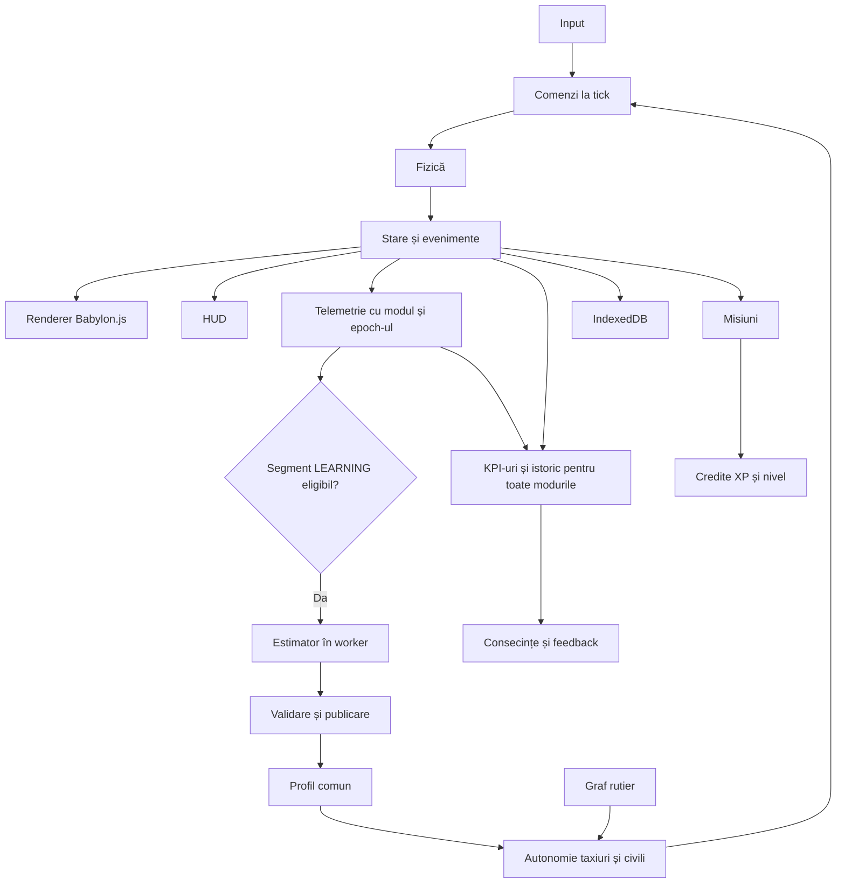

# Arhitectură și contracte

Versiune 0.5 · 4 octombrie 2026. Parte din [planul complet](README.md). Babylon.js este engine-ul ales. Valorile de calibrare și țintele de performanță necesită verificare prin prototip.

## Stack ales

Aplicație TypeScript cu Vite; Babylon.js pentru scene, randare, camere, picking și asseturi; Rapier 3D pentru fizică prin adaptor propriu; HTML și CSS pentru HUD; IndexedDB pentru persistență; Web Workers pentru estimare și experimente. Bootstrapul 001 fixează Vite 8.3.2, TypeScript 7.0.2 și pachetele Babylon.js core/loaders 9.29.0 în package.json și package-lock.json; runtime verificat Node.js 24.21.0 și npm 11.19.0. [Comenzile locale](../README.md#dezvoltare-locală) folosesc npm ci pentru instalare reproductibilă. Pachetele pentru fizică și persistență se introduc în scope-ul lor; nu folosim o versiune flotantă la release.

Rapier este propunerea de bază pentru controllerul auto. PBI-ul de calibrare verifică dacă poate realiza aderența, suspensia și frânarea cerute. Dacă baza nu este potrivită, se înregistrează o decizie de fizică și se actualizează contractele și task-urile afectate; Babylon.js rămâne engine-ul ales. Nu rulează două motoare fizice pentru aceeași mașină.

## Responsabilități și direcția dependențelor

| Modul | Responsabilitate | Contract către restul aplicației |
| --- | --- | --- |
| app | Bootstrap și lifecycle | AppState și servicii injectate |
| simulation | Tick-uri și starea autoritară | Snapshot și evenimente |
| world | Benzi, intersecții și reguli | RoadGraph și query-uri semantice |
| vehicles | Fizică și comenzi comune | VehicleCommand și VehicleState |
| autonomy | Context, decizii și control | Comenzi și motive |
| fleet | Curse și dispecerizare | FleetState și Ride |
| economy | Tarife, review-uri și agregări | RevenueEntry, RideReview și FleetKpiBucket |
| missions | Campanie și seturi zilnice | MissionProgress și DailyMissionSet |
| progression | Credite XP și nivel fără pierderi | PlayerProgress și XpEntry |
| sessions | Academie/Haos și resetul lumii | SessionKind, worldEpoch și checkpoint activ |
| challenges | Provocări random și recorduri | ChallengeTemplate și ChallengeInstance |
| destructibles | Decor interactiv și evenimente de impact | DestructibleDefinition și DestructibleState |
| rendering | Adaptor Babylon | Transformări interpolate și entityId |
| ui/input | Comenzi ale jucătorului și afișare | Intenții pentru următorul tick |
| telemetry | Segmente și oportunități | InterventionSegment |
| learning | Estimare în worker | ProfileDelta candidat |
| profiles | Versionare și activare | Profil imuabil și activationTick |
| experiments | Snapshot, replay și comparații | Rezultate cu expunere și seed |
| persistence | Salvare și migrare | Tranzacții locale și export |

Rendererul primește stări și nu decide comportamentul. UI trimite intenții și nu modifică direct corpurile fizice. Workerul nu scrie direct profilul activ; serviciul de profiluri validează rezultatul. Starea unei misiuni se derivă din evenimente idempotente, nu din mesaje HUD.

## Layout modular

src/app, src/simulation, src/world, src/vehicles, src/autonomy, src/fleet, src/rendering/babylon, src/ui, src/input, src/telemetry, src/learning, src/profiles, src/experiments, src/persistence, src/missions, src/economy, src/progression, src/sessions, src/challenges, src/destructibles și src/audio. public/assets conține asseturi versionate; scenariile și datele hărții sunt separate de cod. tests/scenarios păstrează cazurile reproductibile.

002 creează entry points publice `index.ts` pentru toate modulele și separă bootstrapul în composition root, simulare, profil, renderer, view DOM și store volatil. [Layoutul implementat](module-layout.md) descrie direcțiile de import și verificarea `npm run check:architecture`. Modulele fără servicii încă au entry points rezervate; contractele complete, gameplay-ul și backendul GPU rămân în PBI-urile dedicate. Profilul și snapshotul bootstrap sunt readonly și înghețate defensiv la runtime; adaptoarele nu primesc starea mutabilă internă.

[Convențiile de dezvoltare](development-conventions.md) documentează verificările statice, unitățile SI și validarea datelor `unknown` la limitele aplicației.

## Ordinea unui tick

1. Aplică intențiile valide și activările programate de profil.
2. Actualizează fazele semafoarelor și stările evenimentelor rutiere.
3. Evaluează deciziile autonome programate și evenimentele urgente.
4. Rezolvă sursa unică de comenzi pentru fiecare vehicul.
5. Integrează fizica cu pas fix și colectează contacte.
6. Produce evenimente semantice, actualizează cursele și misiunile.
7. Colectează telemetrie și publică snapshot pentru renderer și UI.

Pauza oprește tick-urile. Randarea poate afișa UI în pauză. Inputul și comenzile din viitor sunt identificabile prin tick; rezultatele de worker au baseVersionId, segmentId, profileId și learningEpoch.

## Contractele de date și evenimente

Datele motorului folosesc unități SI, identificatori stabili și timp de simulare. Datele calendaristice sunt folosite pentru istoricul salvării. Profilurile sunt imuabile; starea vehiculelor și a curselor este mutabilă numai în serviciul de simulare.

| Contract | Câmpuri esențiale |
| --- | --- |
| VehicleCommand | throttle, brake, steering, handbrake, turnSignal, source, tick |
| VehicleState | vehicleId, classId, transform, velocity, laneId, controlMode, appliedProfileVersion, maneuverState |
| Ride | rideId, taxiId, pickupId, dropoffId, status, assignedTick, completedTick, failureReason |
| InterventionSegment | segmentId, vehicleId, controlMode, learningEligible, playerId, profileId, learningEpoch, startTick, endTick, closeReason, engineVersion, samples, events, completeness |
| DrivingProfile | profileId, versionId, parentVersionId, schemaVersion, engineVersion, parameters, evidenceByParameter |
| ParameterEvidence | key, effectiveCount, contexts, quality, uncertainty, sourceSegmentIds, estimatorVersion |
| ProfileDelta | baseVersionId, nextVersionId, changes, reasons, validationStatus |
| ScenarioSnapshot | mapVersion, engineVersion, physicsVersion, initialWorldState, demandSchedule, seeds |
| MissionProgress | missionId, missionVersion, status, objectiveValues, rewardState, lastEventId |
| SessionCheckpoint | checkpointId, tick, versions, physicsSnapshot, worldState, controllerState, opportunities, rngState, learningEpoch, ledgers |
| WorldReplayChunk | schemaVersion, versions, startTick, endTick, checkpointId, entities, events, completeness |
| RideReview / RevenueEntry | reviewId/transactionId, rideId, customerId, rating/amount, reasons, modelVersion, tick |
| FleetKpiBucket | periodId, revenueMinorUnits, completedRides, reviewCount, ratingSum, ratingHistogram, exposureSeconds |
| DailyMissionSet | playerId, dailyDate, calendarTimeZone, generatorVersion, seed, capabilitySnapshot, instances, expiresAt |
| PlayerProgress / XpEntry | playerId, xpBalance, level, ruleVersion, entryId, amount, causeId, evidence |
| SessionIdentity | sessionId, sessionKind, worldEpoch, activeCheckpointId |
| ControlPreferences | version, steeringSensitivity, returnRate, speedAttenuation, throttleRamp, brakeRamp, cameraMotion, fov |
| ChallengeInstance | instanceId, sessionId, worldEpoch, templateVersion, objectiveSnapshot, status, deadlineTick, rewardId |
| DestructibleState | objectId, archetype, state, transform, lastEventId |
| SavefileEnvelope | format, formatVersion, integrityVersion, createdAt, payload, checksum |

Evenimentele au eventId, type, tick, entityIds și payload validat. Comenzile de input și activările de profil sunt procesate la limite de tick. Evenimentele de UI primesc copii sau proiecții și nu modifică direct motorul. workerJobId, segmentId, baseVersionId, profileId și learningEpoch leagă rezultatele estimării de cauza și ținta lor.

Versiunile exportului și ale schemelor permit migrare explicită. Un fișier de la o schemă mai nouă nu este reinterpretat în tăcere. Testele de compatibilitate includ profiluri valide, versiuni vechi migrabile, valori invalide și chei rezervate încă neimplementate.

## Invariante comune

Există maximum un vehicul în MANUAL sau LEARNING. Fiecare corp fizic are un entityId stabil; mesh-ul este reprezentarea sa. Taxiurile și civilii au aceeași versiune după tick-ul de activare. Numai LEARNING eligibil produce demonstrații; AUTO/MANUAL și replay-ul nu contribuie la learning. Selecția mută camera și nu preia implicit autoritatea. Joburile unei learningEpoch invalidate nu se aplică peste ținta nouă. Ledger-ele de revenue, reviews, rewards și XP sunt idempotente, cu un singur writer live. Niciun parametru neimplementat nu este raportat ca învățat. Variantele V2 și V3 adaugă contexte fără să schimbe unitățile sau identitatea profilurilor existente.

## Contracte economice și de progres

economy consumă rezultate ale curselor și consecințe pentru tarife/reviews/KPI-uri. progression consumă credite din misiuni/provocări eligibile și timp activ Academie, fără a modifica DrivingProfile. Worker-ele de experimente folosesc lumi și ledger-e izolate. SessionCheckpoint, WorldReplayChunk și agregările din modulele 22–23 sunt scheme distincte. Timpul economic, timpul calendaristic daily și minutele active XP nu se substituie reciproc.

## Contracte de resurse și performanță

PerformanceReport și manifestul de bugete au versiuni proprii, hardware/backend/preset și fixture identificabile. WorkerJob include payloadBytes, ownership, prioritate, stare de admitere și progres. Un singur coordonator bugetează joburile grele; UI nu poate lansa lumi de comparație nelimitate; XP nu are evaluator în worker. Captura checkpointului este separată de encode/commit și are cost sincron măsurat. [Modulul 25](25-performanta-contracte-si-benchmark.md) definește ordinea, backpressure-ul și performance_checks din PBI.

## Contracte V1 pentru distracție

[Modulele 26](26-joaca-libera-haos-si-distrugere.md), [27](27-reglaje-hud-si-camera.md), [28](28-provocari-random-si-revenire.md) și [29](29-savefile-si-integritate.md) definesc izolarea sesiunilor, reseturile, proveniența sliderelor, evaluatorii provocărilor și checksumul. Evenimentele/comenzile/joburile includ sessionId/worldEpoch; comparațiile au context izolat. Tick-ul produce tranzițiile destructibile după contacte, apoi obiectivele/creditele idempotente. Resetul schimbă generația lumii înaintea oricărui eveniment nou. Savefile-ul validează integritatea înaintea activării oricărei stări.
