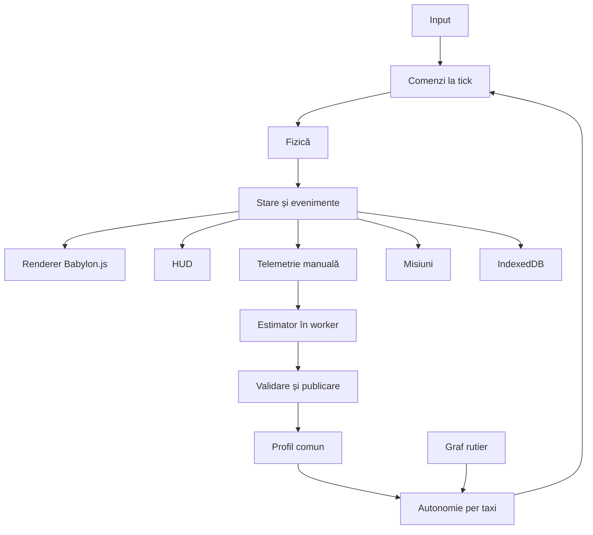

# Arhitectură și contracte

Versiune 0.2 · 4 octombrie 2026. Parte din [planul complet](README.md). Babylon.js este engine-ul ales. Valorile de calibrare și țintele de performanță necesită verificare prin prototip.

## Stack ales

Aplicație TypeScript cu Vite; Babylon.js pentru scene, randare, camere, picking și asseturi; Rapier 3D pentru fizică prin adaptor propriu; HTML și CSS pentru HUD; IndexedDB pentru persistență; Web Workers pentru estimare și experimente. Versiunile exacte se aleg și se fixează în lockfile în primul PBI de bootstrap. Nu folosim o versiune flotantă la release.

Rapier este propunerea de bază pentru controllerul auto. PBI-ul de calibrare verifică dacă poate realiza aderența, suspensia și frânarea cerute. Dacă baza nu este potrivită, se înregistrează o decizie de fizică și se actualizează contractele și task-urile afectate; Babylon.js rămâne engine-ul ales. Nu rulează două motoare fizice pentru aceeași mașină.

## Responsabilități și direcția dependențelor

| Modul | Responsabilitate | Contract către restul aplicației |
| --- | --- | --- |
| app | Bootstrap și lifecycle | AppState și servicii injectate |
| simulation | Tick-uri și starea autoritară | Snapshot și evenimente |
| world | Benzi, intersecții și reguli | RoadGraph și query-uri semantice |
| vehicles | Fizică și comenzi comune | VehicleCommand și VehicleState |
| autonomy | Context, decizii și control | Comenzi și motive |
| fleet | Curse și dispecerizare | FleetState și Ride |
| rendering | Adaptor Babylon | Transformări interpolate și entityId |
| ui/input | Comenzi ale jucătorului și afișare | Intenții pentru următorul tick |
| telemetry | Segmente și oportunități | InterventionSegment |
| learning | Estimare în worker | ProfileDelta candidat |
| profiles | Versionare și activare | Profil imuabil și activationTick |
| experiments | Snapshot, replay și comparații | Rezultate cu expunere și seed |
| persistence | Salvare și migrare | Tranzacții locale și export |

Rendererul primește stări și nu decide comportamentul. UI trimite intenții și nu modifică direct corpurile fizice. Workerul nu scrie direct profilul activ; serviciul de profiluri validează rezultatul. Starea unei misiuni se derivă din evenimente idempotente, nu din mesaje HUD.

## Layout propus pentru implementare

src/app, src/simulation, src/world, src/vehicles, src/autonomy, src/fleet, src/rendering/babylon, src/ui, src/input, src/telemetry, src/learning, src/profiles, src/experiments, src/persistence, src/missions și src/audio. public/assets conține asseturi versionate; scenariile și datele hărții sunt separate de cod. tests/scenarios păstrează cazurile reproductibile.

## Ordinea unui tick

1. Aplică intențiile valide și activările programate de profil.
2. Actualizează fazele semafoarelor și stările evenimentelor rutiere.
3. Evaluează deciziile autonome programate și evenimentele urgente.
4. Rezolvă sursa unică de comenzi pentru fiecare vehicul.
5. Integrează fizica cu pas fix și colectează contacte.
6. Produce evenimente semantice, actualizează cursele și misiunile.
7. Colectează telemetrie și publică snapshot pentru renderer și UI.

Pauza oprește tick-urile. Randarea poate afișa UI în pauză. Inputul și comenzile din viitor sunt identificabile prin tick; rezultatele de worker au baseVersionId și segmentId.

## Contractele de date și evenimente

Datele motorului folosesc unități SI, identificatori stabili și timp de simulare. Datele calendaristice sunt folosite pentru istoricul salvării. Profilurile sunt imuabile; starea vehiculelor și a curselor este mutabilă numai în serviciul de simulare.

| Contract | Câmpuri esențiale |
| --- | --- |
| VehicleCommand | throttle, brake, steering, handbrake, turnSignal, source, tick |
| VehicleState | vehicleId, classId, transform, velocity, laneId, controlMode, appliedProfileVersion, maneuverState |
| Ride | rideId, taxiId, pickupId, dropoffId, status, assignedTick, completedTick, failureReason |
| InterventionSegment | segmentId, vehicleId, startTick, endTick, closeReason, engineVersion, samples, events, completeness |
| DrivingProfile | profileId, versionId, parentVersionId, schemaVersion, engineVersion, parameters, evidenceByParameter |
| ParameterEvidence | key, effectiveCount, contexts, quality, uncertainty, sourceSegmentIds, estimatorVersion |
| ProfileDelta | baseVersionId, nextVersionId, changes, reasons, validationStatus |
| ScenarioSnapshot | mapVersion, engineVersion, physicsVersion, initialWorldState, demandSchedule, seeds |
| MissionProgress | missionId, missionVersion, status, objectiveValues, rewardState, lastEventId |

Evenimentele au eventId, type, tick, entityIds și payload validat. Comenzile de input și activările de profil sunt procesate la limite de tick. Evenimentele de UI primesc copii sau proiecții și nu modifică direct motorul. workerJobId, segmentId și baseVersionId leagă rezultatele estimării de cauza lor.

Versiunile exportului și ale schemelor permit migrare explicită. Un fișier de la o schemă mai nouă nu este reinterpretat în tăcere. Testele de compatibilitate includ profiluri valide, versiuni vechi migrabile, valori invalide și chei rezervate încă neimplementate.

## Invariante comune

Există maximum un vehicul manual. Fiecare corp fizic are un entityId stabil; mesh-ul este reprezentarea sa. Toate taxiurile au aceeași versiune după tick-ul de activare. Datele autonome nu devin demonstrații manuale. Niciun parametru neimplementat nu este raportat ca învățat. Variantele V2 și V3 adaugă contexte fără să schimbe unitățile sau identitatea profilurilor existente.
