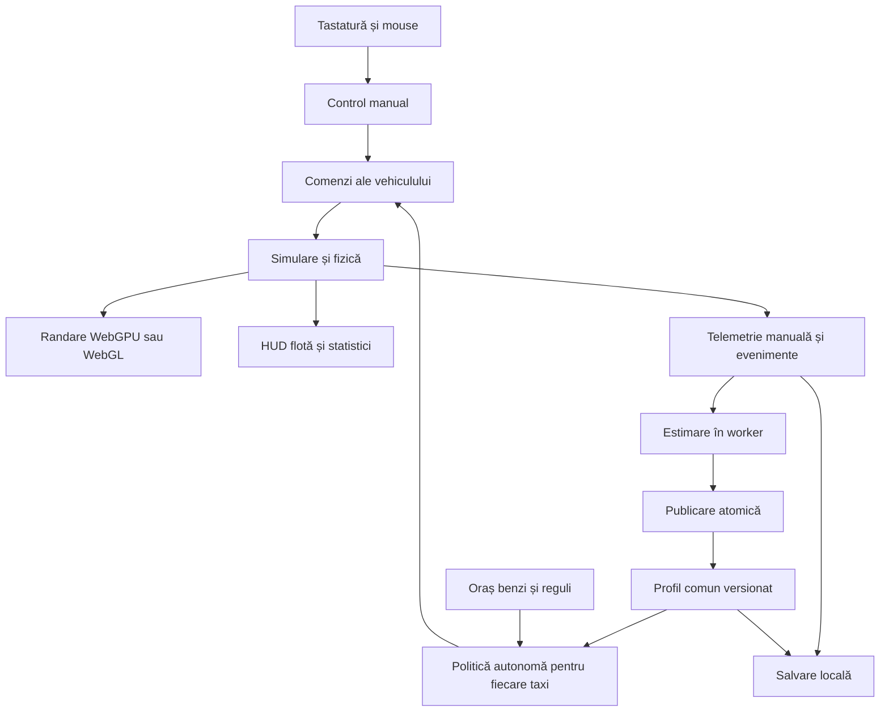

# Self Driving Academy Documentație de produs și plan tehnic

Document de proiectare pentru un joc de condus și experimentare cu o flotă de taxiuri autonome. Jucătorul demonstrează un stil prin intervenții manuale, iar flota preia tendințele măsurate, inclusiv încălcările regulilor. Documentul servește drept bază pentru gameplay, interfață, simulare, învățare și implementare.

Versiune de document 0.1, redactată la 4 octombrie 2026. Numele de lucru este Self Driving Academy. Cerințele confirmate sunt separate de propunerile de proiectare. Valorile de calibrare și țintele de performanță sunt propuneri care trebuie validate prin prototip; documentul nu raportează rezultate ale unui joc deja implementat.

## Cerințe confirmate

| Domeniu | Decizie |
| --- | --- |
| Platformă | Browser pe PC și laptop, cu tastatură și mouse |
| Perspectivă | Oraș 3D și cameră din spatele mașinii |
| Vehicule | Jucătorul poate conduce orice mașină și poate selecta rapid orice taxi |
| Flotă inițială | Aproximativ 20–30 de taxiuri, într-un cartier compact, alături de trafic obișnuit |
| Interfață | Inspirație GTA San Andreas, listă a taxiurilor și a curselor, mod de control vizibil |
| Control | Hotkey pentru SELF-DRIVING și MANUAL INTERVENTION |
| Învățare | Din curse complete și intervenții de câteva străzi |
| Propagare | Automat, după fiecare intervenție manuală, către toate taxiurile din hartă |
| Greșeli | Flota copiază inclusiv condusul agresiv și încălcările regulilor |
| Fizică | Mai realistă, cu aderență, frânare și control al mașinii importante |
| Gameplay | Misiuni, curse, provocări și progres |
| Oraș | Cartier fictiv cu atmosferă americană, apropiată de GTA San Andreas |
| Persistență | Single-player, salvare locală în browser și export/import de profil |
| Mers pe jos | Extensie ulterioară |

## Propuneri de calibrare

Propuneri pentru prima versiune: trafic pe dreapta, vreme uscată și lumină de zi; flotă standard de 24 de taxiuri; 40 de vehicule de trafic obișnuit; două clase de mașini; pasageri reprezentați simplificat; trafic obișnuit cu profiluri fixe. Regulile jocului sunt definite în datele hărții și ale scenariilor.

Bugetul, echipa, calendarul și hardware-ul minim exact nu sunt cunoscute. Planul stabilește dependențe și criterii de acceptare fără estimări fictive de durată. Numele de lucru Self Driving Academy și toate valorile numerice de calibrare rămân propuneri.

## Experiența principală

Jucătorul observă taxiurile, selectează unul și vede cursa curentă. Taxiul merge autonom până când jucătorul preia controlul. Jucătorul conduce o porțiune sau întreaga cursă, apoi revine la autonomie. Jocul explică ce a putut învăța și publică automat un profil nou, pe care îl adoptă flota.

Obiectivul observabil este reproducerea tendințelor jucătorului în contexte comparabile. Același profil poate produce acțiuni diferite pe străzi diferite, în mașini diferite sau în trafic diferit. Jucătorul poate vedea dacă stilul său produce livrări rapide, disconfort, aglomerație, încălcări sau accidente.

Un exemplu de sesiune: profilul inițial păstrează distanță mare și pleacă lent de la semafor. Jucătorul conduce câteva străzi, urmărește mai aproape mașina din față și reacționează mai repede la verde. Jocul actualizează doar parametrii susținuți de acele observații. Celelalte taxiuri adoptă profilul și, când întâlnesc situații similare, manifestă aceleași tendințe.

## Limitele primei versiuni

Prima versiune include conducere manuală, autonomie pe un graf de benzi, curse cu pickup și dropoff, trafic obișnuit, semafoare, STOP, priorități, coliziuni, profiluri versionate, telemetrie și comparații. Condusul liber permite abateri de la traseu și contact cu borduri sau alte vehicule.

Mersul pe jos, interioarele, multiplayer-ul, percepția prin camere sau LiDAR simulat, vremea dinamică și antrenarea unei rețele neuronale sunt extensii. Autonomia folosește inițial informațiile structurale ale simulării. Învățarea parametrilor este nucleul produsului și nu presupune apeluri la un model conversațional.

Manevrele pe care politica autonomă nu le poate reprezenta, precum cascadoriile sau condusul deliberat pe trotuar, rămân vizibile în înregistrare și în statistici. Interfața le marchează ca comportamente nereproduse de profil; nu pretinde că le-a învățat.

## Orașul și vehiculele

Propunere de hartă: un cartier fictiv cu atmosferă americană, de aproximativ 800 pe 800 de metri, cu 12–16 cvartale, drumuri cu una și două benzi pe sens, sensuri unice, cel puțin patru intersecții semaforizate, patru intersecții cu STOP, două intersecții cu prioritate, treceri de pietoni și zone de pickup. Dimensiunea exactă se ajustează după testele de gameplay și performanță.

Geometria vizuală și semantica rutieră sunt separate. Fiecare bandă are direcție, lățime, limită de viteză, legături către benzi vecine și restricții de acces. Intersecțiile definesc mișcări permise și zone de conflict. Semafoarele au faze asociate explicit cu mișcările, iar STOP și trecerile de pietoni au linii și zone de oprire. Valorile din hartă reprezintă regulile jocului.

Vehiculele împărtășesc un contract de comandă: accelerație, frână, direcție, frână de mână și semnalizare. Controlul manual și controlul autonom folosesc aceeași fizică și aceleași limite mecanice. Masa, aderența, puterea, capacitatea de frânare și raza de viraj sunt caracteristici ale vehiculului, separate de stilul șoferului.

Propunere: toate intervențiile manuale pot contribui la profilul jucătorului, inclusiv cele realizate în mașini civile. Estimarea normalizează capacitățile vehiculului, astfel încât o mașină puternică să nu fie confundată cu o intenție mai agresivă. Vehiculele civile revin la profilul lor fix când sunt eliberate; actualizarea stilului jucătorului afectează numai taxiurile.

## Sistemul de curse și flotă

O cursă are identificator, punct de preluare, destinație, moment de creare, taxi alocat, traseu și istoric de evenimente. Fluxul propus este AVAILABLE → TO_PICKUP → PICKUP → TO_DROPOFF → DROPOFF → COMPLETED. FAILED și CANCELLED sunt rezultate explicite, cu motiv.

Pickup și dropoff se finalizează când taxiul intră în zona definită, ajunge la viteza cerută și rămâne suficient timp. Sosirea vizuală la marker fără oprire nu finalizează cursa. Pasagerul poate fi reprezentat printr-un personaj simplu sau un indicator; antrenarea stilului nu depinde de animațiile sale.

Dispecerizarea folosește inițial un cost simplu bazat pe timp estimat până la pickup și disponibilitate. Nu este învățată din stilul de condus. Traseele și alocările sunt păstrate când jucătorul schimbă taxiul. Un taxi blocat sau avariat primește un statut explicit, iar recuperarea sa este înregistrată.

Lista flotei afișează ID, mod de control, etapa cursei, pickup, destinație, ETA estimat, viteză, profil aplicat și eventualul motiv al blocajului. Sortarea după ID este stabilă; filtrele permit taxiuri disponibile, în cursă, blocate și selectate.

## Camera și interfața

HUD propus: minimap și rută în stânga jos; viteză în dreapta jos; ID taxi, modul de control și profilul activ sus; etapa cursei și următorul obiectiv într-o zonă compactă; notificări temporare pentru învățare. Culorile modurilor sunt însoțite de text și simbol, astfel încât diferența să rămână lizibilă fără distingerea culorilor.

Panoul flotei permite selectarea oricărui taxi fără a muta fizic vehiculele. Mașinile civile se selectează prin click pe vehiculul vizibil sau pe markerul lui de pe hartă, apoi prin aceeași acțiune de preluare a controlului. Traficul civil are destinații sau rute proprii pe care le reia la eliberare. Camera trece către taxiul ales. În modul autonom jucătorul îl observă; după comutarea în manual îl conduce. Dacă părăsește un taxi condus manual, intervenția se închide, taxiul revine la autonomie și cursa sa continuă.

Panoul profilului afișează valorile curente, diferența față de versiunea precedentă, situațiile care au susținut schimbarea, cantitatea de dovezi și parametrii încă neobservați. Notificarea poate spune: „Profil nou: distanță mai mică în mers și reacție mai rapidă la verde”. Valorile concrete provin exclusiv din datele sesiunii.

Tabloul orașului arată curse finalizate, timpi, distanță parcursă, încălcări, coliziuni, blocaje și confort. Jucătorul poate inspecta fiecare eveniment pe hartă și poate compara două profiluri în același scenariu.

## Comenzi propuse

| Comandă | Acțiune |
| --- | --- |
| W / S | Accelerație și frână; marșarier la viteză apropiată de zero |
| A / D | Direcție |
| Space | Frână de mână |
| M | Comutare SELF-DRIVING / MANUAL INTERVENTION |
| Tab | Deschidere sau închidere listă flotă |
| Click pe taxi în listă | Selectare taxi și mutare cameră |
| Q / E | Semnalizare stânga / dreapta |
| C | Schimbare cameră din spate / capotă, dacă a doua cameră este activată |
| P | Panou profil și istoric |
| Escape | Pauză și meniu |
| R | Recuperare la ultimul punct valid, după afișarea consecinței |

Hotkey-urile sunt remapabile. Butoanele din HUD oferă echivalente pentru acțiunile importante. Când un câmp de text sau un dialog are focus, tastele nu controlează vehiculul. Meniul de pauză și pierderea focusului opresc simularea single-player; panourile flotei și profilului pun simularea pe pauză dacă jucătorul conduce manual. În observare autonomă, panoul flotei rămâne live. Închiderea panoului reia simularea și resetează tastele ținute, prevenind o comandă rămasă activă.

## Moduri de control și închiderea intervențiilor

Există cel mult un vehicul sub control manual. Modul de control, etapa cursei și versiunea profilului sunt stări independente. Un taxi poate fi autonom și în drum spre pickup sau manual și în drum spre dropoff.

La AUTO → MANUAL, sistemul deschide un segment cu poziția, viteza, ruta, contextul rutier, clasa vehiculului și versiunea de profil existente. Comenzile AI încetează la pasul de simulare în care controlul manual începe. La MANUAL → AUTO, segmentul este închis, estimarea este lansată și autonomia reia controlul din starea fizică actuală.

Închiderea este declanșată de revenirea la autonomie, schimbarea mașinii, finalizarea cursei, recuperare sau ieșirea din sesiune. Dacă jucătorul rămâne manual după finalizarea unei curse, se deschide un segment nou fără a schimba modul de control. Pauza suspendă segmentul. Un crash de browser păstrează numai datele deja salvate, marcând segmentul incomplet.

Sistemul acceptă și segmente scurte. O intervenție fără suficiente situații informative produce „Nicio modificare justificată” și nu creează artificial o versiune nouă. Aplicația arată clar momentul în care analiza este în curs și momentul în care flota a adoptat rezultatul.

La revenirea la autonomie în afara unei benzi, politica caută o reintrare fezabilă în graful rutier. Dacă nu există, taxiul este marcat BLOCKED și oferă recuperarea explicită. Preluarea controlului nu teleportează mașina și nu șterge accidentele.

## Motorul autonom

Motorul are șase componente: context rutier, planificare de traseu, alegerea comportamentului, planificare locală, control al vehiculului și raportare. Contextul include vehicule apropiate, banda curentă, semnalul aplicabil, regulile intersecției, obstacole și zone de pickup.

Comportamentele includ urmărirea benzii, urmărirea unui vehicul, oprirea, traversarea intersecției, cedarea priorității, schimbarea benzii, pickup, dropoff și recuperarea. Alegerea lor citește profilul; controllerul transformă țintele în accelerație, frână și direcție.

Încălcările sunt decizii ale politicii atunci când profilul învățat le permite. O probabilitate mai mică de oprire la roșu produce treceri pe roșu în oportunități relevante. Un interval mai mic de urmărire reduce distanța la viteze similare. Limitele tehnice protejează validitatea simulării și capacitățile mașinii; nu suprascriu toate greșelile cu o conduită regulamentară.

Fiecare taxi raportează motivul acțiunii curente, de exemplu FOLLOW_LEADER, WAIT_RED, CROSS_RED_BY_PROFILE, YIELD_CONFLICT sau BLOCKED_ROUTE. Aceste motive permit verificarea vizuală și tehnică a influenței parametrilor.

## Arhitectura propusă

Propunere de stack: TypeScript și Vite pentru aplicație; Babylon.js pentru randare; Rapier 3D pentru fizică, după validarea controllerului de vehicul; interfață HTML și CSS; IndexedDB pentru salvare; Web Workers pentru estimare și experimente. Interfața poate folosi un framework dacă proiectul îl cere, dar bucla fizicii rămâne independentă de rerandarea componentelor UI.

Babylon.js documentează suport WebGPU și WebGL și un set de funcții potrivit unui joc 3D. Three.js oferă o alternativă cu WebGPURenderer și fallback WebGL 2. Alegerea Babylon.js este o propunere de proiect, nu rezultatul unui benchmark comparativ. [Babylon.js specifications](https://www.babylonjs.com/specifications/) și [Three.js WebGPURenderer](https://threejs.org/docs/pages/WebGPURenderer.html)

Rapier oferă un modul WebAssembly pentru JavaScript și un controller de vehicul cu roți bazate pe ray casting. Integrarea cu scena Babylon se va face printr-un adaptor propriu între corpurile fizice și reprezentările vizuale; nu se presupune existența unui plugin Rapier integrat în Babylon. Înaintea alegerii finale, un prototip verifică frânarea, coliziunile, bordurile și comportamentul celor două clase de mașini. [Rapier getting started](https://rapier.rs/docs/user_guides/javascript/getting_started_js/) și [Vehicle controller API](https://rapier.rs/javascript3d/classes/DynamicRayCastVehicleController.html)

Sursa de adevăr este starea simulării. Rendererul primește transformări și nu decide comportamentul. Estimatorul primește copii ale segmentelor, fără acces direct pentru a modifica vehiculele. Rezultatul său este o propunere validată de serviciul de profiluri. Publicarea transmite un profil imuabil și un pas de activare comun.

Structura logică propusă: app, input, ui, rendering, world, simulation, vehicles, fleet, autonomy, telemetry, learning, profiles, experiments, persistence și assets. Contractele publice includ VehicleCommand, WorldSnapshot, InterventionSegment, DrivingProfile, ProfileDelta, FleetState și ScenarioSnapshot.

## Fizica și senzația de condus

Realismul primei versiuni înseamnă distanțe de frânare dependente de viteză și aderență, transfer credibil al sarcinii, pierderea aderenței în viraje, suspensie, inerție și diferențe între clasele vehiculelor. Modelul final se alege prin prototip. Un controller cu ray casting este o bază de evaluare, nu o garanție că întreaga dinamică a anvelopelor este simulată fidel.

Inputul digital al tastaturii este filtrat printr-o curbă de accelerație, frână și direcție, cu viteză de revenire și sensibilitate dependentă de viteză. Această asistență de input este fixă și documentată; estimatorul observă atât tastele, cât și comenzile efective. Nu învață ca preferință personală oscilațiile produse de limita tastaturii.

Pragurile mecanice aparțin configurației vehiculului. Profilul șoferului exprimă accelerații dorite și spații acceptate, apoi controllerul le realizează în limita aderenței și puterii. Condusul agresiv poate produce derapaje, frânare insuficientă și coliziuni. Sistemul nu adaugă imunitate fizică taxiurilor autonome.

Scenele de calibrare includ frânare de la viteze repetabile, viraje cu rază fixă, schimbare de bandă, impact cu bordură și contact între două mașini. Se verifică stabilitatea numerelor și coerența manual versus autonom înainte de construirea campaniei.

## Misiuni și progres

Campania introduce mecanicile în ordine și păstrează libertatea de a demonstra un stil riscant. Progresul poate evalua rezultate diferite: finalizarea cursei, fidelitatea imitației, confortul, viteza serviciului sau efectul asupra orașului. Învățarea nu șterge automat greșelile pentru a acorda un scor bun.

| Etapă | Misiune propusă | Condiție de progres |
| --- | --- | --- |
| 1 | Primul taxi | Selectează un taxi, comută în manual și finalizează o cursă |
| 2 | Prima demonstrație | Închide o intervenție cu cel puțin un parametru susținut de date și vezi publicarea în flotă |
| 3 | Distanța în trafic | Demonstrează două stiluri de urmărire și identifică diferența dintre profiluri |
| 4 | STOP și semafoare | Întâlnește oportunități relevante și inspectează comportamentul învățat |
| 5 | Pasagerul | Finalizează o cursă cu obiectiv explicit de confort |
| 6 | Orașul te copiază | Rulează un scenariu cu întreaga flotă și inspectează efectele stilului |
| 7 | Schimbarea unui obicei | Creează o versiune nouă din demonstrații repetate și compară două profiluri |
| 8 | Provocarea flotei | Finalizează un scenariu cu obiective de serviciu și buget de incidente afișate |

Recompensele propuse sunt deblocări de provocări, clase de mașini și instrumente de analiză. Capacitățile de bază de a conduce orice mașină existentă și de a selecta orice taxi sunt disponibile de la început. Nu se condiționează accesul la taxiurile existente de nivelul jucătorului.

O misiune are ID stabil, condiții de pornire, obiective, praguri, fereastră de evaluare, stare, recompensă și reguli de reluare. Obiectivele sunt calculate din evenimente ale simulării, nu din textul HUD. Eșecul unei misiuni păstrează profilurile învățate; reluarea arată dacă folosește profilul curent sau un snapshot inițial.

Jocul păstrează separat rezultatul misiunii, fidelitatea stilului și indicatorii orașului. Nu comprimă toate efectele într-un singur scor de „șofer bun”. Provocările care cer respectarea regulilor o spun explicit; experimentele de imitație pot reuși și cu un profil problematic.

## Catalogul parametrilor

Catalogul conține 80 de parametri propuși pentru politica jocului. Aceștia sunt parametri ai motorului nostru, nu opțiuni preexistente în Babylon.js sau Rapier. Toate valorile inițiale și intervalele sunt convenții de calibrare pentru simulare, fără pretenția de a reprezenta limite legale ori recomandări de condus.

M înseamnă candidat pentru implementare și învățare în prima versiune, condiționat de validarea estimatorului. R înseamnă rezervat pentru extensii; cheia poate exista în schema profilului, dar UI indică dacă este implementată, fixă sau încă neînvățabilă. Prima versiune țintește 24 de parametri M. Nu publică estimări pentru chei R doar fiindcă au fost înregistrate comenzi.

Unitățile interne sunt SI. Viteza din HUD poate fi în mph sau km/h; alegerea este o preferință de afișare. Offseturile liniilor de oprire sunt pozitive înaintea liniei. Valorile de frânare sunt module pozitive. Probabilitățile sunt eșantionate o singură dată la intrarea într-o oportunitate identificată, cu histerezis; reeșantionarea în fiecare cadru ar schimba artificial probabilitatea.

„Agresivitatea” este un indicator derivat și explicabil din viteză, distanțe, accelerație și acceptarea spațiilor. Nu este estimată simultan ca parametru ascuns care suprascrie aceleași valori. Un preset poate modifica un set de parametri și crea o versiune explicită.

### Viteză și ritm

Viteză stabilă în trafic liber, separată pe tip de drum; curbe cu rază cunoscută; apropieri de intersecții. Segmentele cu obstacole sau comandă limitată mecanic nu sunt tratate ca viteză preferată.

| Cheie | Inițial | Interval | Unitate | Rol | Etapă |
| --- | --- | --- | --- | --- | --- |
| speed_delta_urban | 0 | -8–15 | m/s | Diferență dorită față de limita urbană | M |
| speed_delta_residential | 0 | -8–12 | m/s | Diferență dorită pe străzi rezidențiale | M |
| speed_delta_arterial | 0 | -10–20 | m/s | Diferență dorită pe artere | R |
| curve_lateral_accel | 2.5 | 0.5–8 | m/s² | Accelerație laterală preferată în curbă | M |
| intersection_approach_speed | 6 | 1–20 | m/s | Viteză de apropiere când nu există oprire impusă | M |
| cruise_speed_variability | 0.3 | 0–3 | m/s | Variație a țintei de viteză | R |
| overtake_speed_bonus | 2 | 0–10 | m/s | Surplus urmărit la depășire | R |
| cruise_accel_deadband | 0.3 | 0.05–2 | m/s | Bandă de toleranță în jurul vitezei țintă | R |

### Accelerație și frânare

Accelerații longitudinale pe drum potrivit, comenzile efective și momentul apariției unui stimul de frânare. Șocurile de coliziune și variațiile produse de suprafața drumului sunt etichetate separat.

| Cheie | Inițial | Interval | Unitate | Rol | Etapă |
| --- | --- | --- | --- | --- | --- |
| desired_acceleration | 1.5 | 0.2–6 | m/s² | Accelerație preferată în mers | M |
| comfort_deceleration | 2 | 0.3–8 | m/s² | Modulul decelerației uzuale | M |
| acceleration_jerk | 2 | 0.2–15 | m/s³ | Viteză de creștere a accelerației | M |
| braking_jerk | 3 | 0.2–20 | m/s³ | Viteză de creștere a frânării | R |
| throttle_release_delay | 0.2 | 0–3 | s | Întârziere înainte de ridicarea accelerației | R |
| brake_reaction_delay | 0.5 | 0–3 | s | Întârziere de reacție la stimul observabil | M |
| launch_intensity | 0.6 | 0–1 | raport | Preferință pentru plecare puternică | R |
| coasting_bias | 0.4 | 0–1 | raport | Preferință pentru rulare fără accelerație | R |

### Urmărire și distanțe

Perechi lider–urmăritor cu bandă comună, viteză suficientă și fără schimbare de lider; cozi oprite și variații controlate ale vitezei liderului.

| Cheie | Inițial | Interval | Unitate | Rol | Etapă |
| --- | --- | --- | --- | --- | --- |
| following_time_headway | 1.8 | 0.2–5 | s | Interval temporal țintă față de lider | M |
| following_min_gap | 3 | 0.2–15 | m | Spațiu fix adăugat intervalului temporal | M |
| queue_standstill_gap | 2 | 0.2–10 | m | Spațiu dorit într-o coadă oprită | M |
| cutin_brake_response | 0.7 | 0–1 | raport | Intensitatea reacției la intrarea altui vehicul | R |
| following_speed_gain | 0.7 | 0.1–2 | 1/s | Reacție la diferența de viteză față de lider | M |
| closing_ttc_threshold | 3 | 0.3–8 | s | Prag de reacție la timpul până la contact | R |
| leader_change_delay | 0.2 | 0–2 | s | Întârziere la adoptarea unui lider nou | R |
| following_hysteresis | 1 | 0–5 | m | Toleranță pentru evitarea oscilației comenzilor | R |

### Semafoare

Oportunități definite prin semnalul aplicabil și apropierea de linie; întârziere la verde numai când vehiculul este primul în coadă și poate pleca.

| Cheie | Inițial | Interval | Unitate | Rol | Etapă |
| --- | --- | --- | --- | --- | --- |
| red_stop_probability | 1 | 0–1 | probabilitate | Probabilitate de oprire la oportunitate de roșu | M |
| yellow_stop_probability | 0.8 | 0–1 | probabilitate | Probabilitate de oprire la galben când oprirea este fezabilă | R |
| green_start_delay | 0.7 | 0–4 | s | Întârziere de plecare după verde | M |
| red_stop_line_offset | 1 | 0–5 | m | Distanță de oprire înaintea liniei | M |
| red_run_gap_acceptance | 2.5 | 0.1–8 | s | Spațiu temporal acceptat când politica traversează pe roșu | R |
| yellow_commit_time | 2 | 0.2–6 | s | Orizont de angajare la galben | R |
| green_launch_acceleration | 1.5 | 0.2–6 | m/s² | Accelerație specifică plecării de la verde | R |
| late_red_brake_threshold | 2 | 0.2–6 | s | Orizont de inițiere a frânării la roșu | M |

### STOP și prioritate

Traversări complete ale zonei STOP, durată sub pragul de viteză și oportunități de cedare cu vehicule care au prioritate. Frânarea cerută de trafic nu este atribuită automat respectării STOP.

| Cheie | Inițial | Interval | Unitate | Rol | Etapă |
| --- | --- | --- | --- | --- | --- |
| stop_full_probability | 1 | 0–1 | probabilitate | Probabilitate de oprire completă la STOP | M |
| stop_dwell_time | 1 | 0–4 | s | Durată a opririi complete | M |
| stop_line_offset | 1 | 0–5 | m | Distanță înaintea liniei STOP | M |
| yield_time_gap | 3 | 0.2–8 | s | Spațiu temporal acceptat pentru traversare cu prioritate cedată | M |
| rolling_stop_speed | 1 | 0.2–5 | m/s | Viteză de traversare când oprirea completă este omisă | R |
| priority_assertiveness | 0.3 | 0–1 | raport | Preferință pentru a revendica o oportunitate de traversare | R |
| allway_stop_patience | 2 | 0–10 | s | Așteptare suplimentară la oprire din toate direcțiile | R |
| blocked_intersection_entry_probability | 0 | 0–1 | probabilitate | Probabilitate de intrare fără spațiu de ieșire | R |

### Schimbare de bandă și depășire

Schimbări complete de bandă cu vehicule apropiate urmărite înainte de inițiere. Acceptarea unui spațiu oferă o limită observată; spațiile refuzate necesită scenarii controlate pentru a identifica pragul.

| Cheie | Inițial | Interval | Unitate | Rol | Etapă |
| --- | --- | --- | --- | --- | --- |
| lane_change_front_gap | 12 | 0.5–40 | m | Spațiu minim acceptat în față la inițiere | M |
| lane_change_back_gap | 10 | 0.5–40 | m | Spațiu minim acceptat în spate la inițiere | M |
| lane_change_speed_gain | 2 | 0–10 | m/s | Avantaj de viteză necesar unei schimbări opționale | M |
| lane_change_cooldown | 6 | 0.5–30 | s | Timp minim între schimbări opționale | M |
| lane_change_duration | 2 | 0.5–5 | s | Durată preferată a manevrei | R |
| signal_lead_time | 1 | 0–5 | s | Timp de semnalizare înaintea manevrei | R |
| signal_use_probability | 1 | 0–1 | probabilitate | Probabilitate de folosire a semnalizării | R |
| pass_on_right_probability | 0 | 0–1 | probabilitate | Preferință de depășire prin dreapta în scenariile permise de hartă | R |

### Control lateral și viraje

Traiectorii normalizate față de centrul benzii și geometria curbei, cu vehicul și aderență cunoscute. Acești parametri cer controller lateral validat.

| Cheie | Inițial | Interval | Unitate | Rol | Etapă |
| --- | --- | --- | --- | --- | --- |
| lane_center_offset | 0 | -1–1 | m | Deplasare preferată față de centrul benzii | R |
| steering_response_time | 0.3 | 0.05–1.5 | s | Timp de răspuns al direcției comandate | R |
| steering_rate_limit | 1 | 0.1–4 | rad/s | Limită preferată de variație a direcției | R |
| turn_entry_speed | 5 | 1–18 | m/s | Viteză preferată de intrare în viraj | R |
| turn_exit_acceleration | 1.5 | 0.2–6 | m/s² | Accelerație preferată la ieșirea din viraj | R |
| corner_cutting_bias | 0 | 0–1 | raport | Preferință pentru scurtarea traiectoriei în viraj | R |
| lateral_clearance | 0.8 | 0.1–3 | m | Spațiu lateral dorit față de obstacole | R |
| lateral_correction_deadband | 0.1 | 0–0.6 | m | Toleranță la abaterea laterală | R |

### Trasee și recuperare

Alegeri repetate între alternative comparabile și situații de blocaj. O singură abatere de la ruta sugerată nu identifică o preferință stabilă.

| Cheie | Inițial | Interval | Unitate | Rol | Etapă |
| --- | --- | --- | --- | --- | --- |
| route_time_weight | 0.6 | 0–1 | pondere | Preferință pentru durată mică | R |
| route_distance_weight | 0.3 | 0–1 | pondere | Preferință pentru distanță mică | R |
| route_turn_penalty | 2 | 0–20 | s/viraj | Cost perceput al unui viraj | R |
| route_signal_penalty | 5 | 0–60 | s/semafor | Cost perceput al unui semafor | R |
| route_congestion_penalty | 0.5 | 0–2 | raport | Sensibilitate la aglomerație | R |
| reroute_patience | 20 | 2–120 | s | Așteptare înainte de recalculare | R |
| u_turn_willingness | 0 | 0–1 | probabilitate | Disponibilitate de întoarcere în contexte modelate | R |
| reverse_recovery_duration | 2 | 0–8 | s | Durată preferată de marșarier la recuperare | R |

### Pietoni și pericole

Oportunități cu pietoni și obstacole, stimul vizibil și zonă de conflict cunoscute. Activarea cere pietoni autonomi și scenarii de pericol reprezentabile.

| Cheie | Inițial | Interval | Unitate | Rol | Etapă |
| --- | --- | --- | --- | --- | --- |
| pedestrian_yield_probability | 1 | 0–1 | probabilitate | Probabilitate de cedare în oportunitate relevantă | R |
| pedestrian_clearance | 2 | 0.1–6 | m | Spațiu dorit față de pieton | R |
| hazard_reaction_delay | 0.5 | 0–3 | s | Întârziere la stimul de pericol | R |
| obstacle_clearance | 1 | 0.1–4 | m | Spațiu dorit față de obstacol | R |
| emergency_brake_intensity | 1 | 0–1 | raport | Fracție din capacitatea de frânare de urgență | R |
| evasive_steer_willingness | 0.3 | 0–1 | probabilitate | Disponibilitate de manevră evazivă | R |
| crosswalk_approach_speed | 5 | 0.5–15 | m/s | Viteză de apropiere de trecere | R |
| horn_use_probability | 0.1 | 0–1 | probabilitate | Probabilitate de claxon în oportunitate definită | R |

### Pickup și confortul pasagerilor

Opriri intenționate în zone de serviciu și segmente cu pasager. Aceste preferințe rămân distincte de pragurile obiectivelor de misiune.

| Cheie | Inițial | Interval | Unitate | Rol | Etapă |
| --- | --- | --- | --- | --- | --- |
| pickup_approach_speed | 3 | 0.5–8 | m/s | Viteză de apropiere de pickup | R |
| pickup_curb_distance | 0.5 | 0.1–2 | m | Distanță preferată față de bordură | R |
| pickup_stop_precision | 1 | 0.2–5 | m | Toleranță de poziționare | R |
| pickup_dwell_time | 3 | 1–10 | s | Durată preferată de așteptare la pickup | R |
| dropoff_approach_speed | 3 | 0.5–8 | m/s | Viteză de apropiere de dropoff | R |
| dropoff_curb_distance | 0.5 | 0.1–2 | m | Distanță preferată la dropoff | R |
| occupied_acceleration_scale | 0.85 | 0.3–1.5 | raport | Modificator de accelerație cu pasager | R |
| occupied_lateral_accel_scale | 0.85 | 0.3–1.5 | raport | Modificator lateral cu pasager | R |

## Date înregistrate și extragerea contextului

Telemetria este colectată la fiecare pas fix, cu compactare propusă la 20 de eșantioane pe secundă pentru analiză și păstrarea timpilor de eveniment la rezoluția simulării. Sunt înregistrate tick, poziție, orientare, viteză, accelerație longitudinală și laterală, input brut, comandă efectivă, clasa vehiculului, capacități mecanice, bandă, tip de drum, limită de viteză, curbură, lider și spații, semnal aplicabil, linie de oprire, conflicte și etapa cursei.

Evenimentele includ MANUAL_START, MANUAL_END, LEADER_ACQUIRED, SIGNAL_CHANGED, STOP_APPROACH, STOP_LINE_CROSSED, FULL_STOP, LANE_CHANGE_STARTED, LANE_CHANGE_COMPLETED, COLLISION, PICKUP și DROPOFF. Fiecare oportunitate are un ID și un rezultat; un singur STOP nu este numărat de zeci de ori pentru că a fost observat în multe cadre.

Segmentul păstrează motivul închiderii, versiunea motorului, versiunea hărții și tipul inputului. Datele din AUTO nu sunt folosite ca demonstrații ale jucătorului. O cursă poate conține mai multe segmente manuale și autonome.

Coliziunile sunt păstrate ca dovezi despre consecințe și decizii anterioare impactului. Impulsul fizic al coliziunii nu este interpretat ca frânare sau direcție intenționată. Recuperările, teleportările, pauzele și intervalele cu pierdere de focus sunt marcate și excluse din estimarea comenzilor. Segmentele parțiale pot contribui doar la evenimentele finalizate și observațiile valide.

## Estimarea stilului

Fluxul propus este: validare segment, etichetare contexte, extragere caracteristici, estimare pe parametri eligibili, verificare a dovezilor, validare în scenarii scurte și compunere a unui delta. Estimatorul rulează în worker; simularea continuă cu profilul existent până când rezultatul poate fi publicat.

Pentru viteza preferată se folosesc ferestre în trafic liber. Pentru distanțe se estimează relația gap ≈ minimumGap + timeHeadway × speed. Separarea celor două valori necesită observații la viteze suficient de variate; la o singură viteză se păstrează parametrul slab identificat. Pentru accelerație și frânare se folosesc statistici robuste din intervale intenționate, normalizate după capacitățile vehiculului.

Pentru roșu și STOP, denominatorul este numărul oportunităților eligibile, nu numărul cadrelor și nici întreaga distanță parcursă. Întârzierea la verde se măsoară de la verde până la plecare doar când vehiculul poate pleca. Pentru acceptarea spațiilor, o manevră reușită oferă o limită observată; un prag exact cere și alegeri între oportunități refuzate și acceptate. Jocul poate furniza scenarii dedicate în misiuni.

Inițial sunt propuse metode statistice explicabile și calibrare locală a politicii în scenarii. Pentru parametrii corelați, sistemul fixează temporar ceilalți și folosește scenarii care îi separă. Nu ajustează toate cele 80 de valori dintr-o singură traiectorie.

### Dovezi și actualizare

Fiecare cheie stochează valoare, număr efectiv de observații, contexte, calitate și incertitudine. „Neobservat” este distinct de zero. Un parametru fără context eligibil rămâne neschimbat.

Propunere de praguri inițiale: trei oportunități distincte pentru o primă estimare de conformare, aproximativ zece secunde de trafic liber pentru viteză, trei episoade și viteze variate pentru urmărire, două plecări neblocate pentru reacția la verde. Sunt praguri de pornire pentru calibrare, nu garanții de învățare. Un eveniment singular poate fi arătat imediat fără să determine singur un obicei stabil.

Actualizarea propusă este newValue = oldValue + learningWeight × (estimate − oldValue). Ponderea depinde de calitate, numărul efectiv de episoade și incertitudine. Are o limită de calibrare pentru a evita salturi provocate de zgomot; demonstrațiile repetate pot modifica puternic profilul. Această regularizare păstrează și stilurile riscante dacă dovezile sunt consistente.

Istoricul recent primește o pondere mai mare decât demonstrațiile foarte vechi, astfel încât jucătorul să își poată schimba stilul. Jucătorul poate crea un profil nou de la bază și poate restaura versiuni. Nu există un lock de învățare activ implicit care ar contrazice aplicarea automată cerută.

Validarea verifică numere finite, intervale, unități, parametri implementați și compatibilitate cu controllerul. Nu respinge o versiune doar pentru că produce încălcări sau coliziuni: acestea pot fi rezultatul urmărit al imitației. Un candidat instabil numeric este respins, iar dovezile și motivul rămân disponibile.

### Rezultatul pentru jucător

După intervenție, panoul arată ce s-a observat, ce s-a modificat și ce a rămas necunoscut. Exemplu ilustrativ, fără date reale: following_time_headway 1.8 s → 1.5 s, din episoade valide; green_start_delay 0.7 s → 0.5 s, din plecări neblocate; stop_full_probability neschimbat, deoarece nu a existat o oportunitate STOP.

Fidelitatea se evaluează în contexte comparabile prin distribuții de viteză, distanțe, accelerații, timpi de reacție și probabilități ale acțiunilor. Copierea inputului tastelor la aceleași momente nu este obiectivul: starea traficului fiecărui taxi este diferită.

## Versiuni și aplicarea în flotă

Versiunea codului motorului, versiunea schemei de parametri și versiunea profilului sunt separate. Un profil nou poate schimba stilul fără să schimbe algoritmul motorului. Orice schimbare de cod sau de schemă este explicită și însoțită de reguli de compatibilitate.

Un profil conține profileId, versionId, parentVersionId, schemaVersion, engineVersion, parameters, evidenceByParameter, sourceSegmentIds, createdAt și checksum. Un ProfileDelta conține baseVersionId, chei schimbate, valori anterioare și noi, motive și dovezi. Indicatorii derivați precum agresivitatea sunt calculați din parametri, cu formula versionată separat.

Intervențiile închise intră într-o coadă serială. Fiecare estimare folosește ultima versiune acceptată când începe. Un rezultat care se referă la o bază depășită este recalculat sau recompus în mod explicit; nu suprascrie schimbările altei intervenții. ID-ul segmentului asigură că același segment nu este aplicat de două ori.

Publicarea creează o versiune imuabilă și o comandă PROFILE_ACTIVATE pentru un tick viitor comun. La acel tick toate taxiurile adoptă aceeași referință de profil, inclusiv taxiul selectat. Un taxi aflat în manual înregistrează referința, dar comenzile manuale au prioritate până la revenirea în AUTO.

Noile ținte sunt folosite la următoarea decizie relevantă. Manevrele deja angajate au o continuitate fizică: schimbarea profilului nu teleportă, nu resetează viteza și nu reeșantionează o oportunitate de roșu deja evaluată. O schimbare de bandă în curs se finalizează sau se abandonează prin regulile controllerului. Astfel adoptarea versiunii este simultană, iar efectele apar în contexte diferite.

Toate taxiurile au același profil de stil. Nu există personalități suplimentare ascunse care să dilueze această cerință. Eșantionările probabilistice au seed-uri pe vehicul și oportunitate, astfel încât un profil probabilistic produce aceeași tendință fără ca toate vehiculele să efectueze simultan aceeași acțiune.

Restaurarea unei versiuni anterioare publică o activare nouă cu proveniență explicită. Versiunile existente nu sunt editate. Un profil importat este validat și devine activ prin același mecanism.

## Indicatori și comparații

Indicatorii de serviciu sunt curse finalizate, rată de finalizare, durată până la pickup, durată de cursă, întârziere față de referință și timpul total blocat. ETA este o estimare și poate varia cu traficul și stilul.

Indicatorii de comportament sunt distribuții de viteză față de limita din hartă, headway la viteze eligibile, reacție la verde, opriri complete și probabilități de încălcare. Indicatorii de confort folosesc accelerație, accelerație laterală și jerk în intervale cu pasager.

Încălcările se raportează per oportunitate relevantă: roșu per apropiere eligibilă, STOP per traversare STOP, prioritate per conflict eligibil. Coliziunile se raportează atât ca număr brut, cât și per 100 de kilometri-vehicul ai flotei; la expunere zero rata este indisponibilă. Durata de depășire a vitezei se raportează la timpul cu o limită validă.

Coliziunile continue între aceeași pereche nu sunt numărate la fiecare cadru. O regulă de separare și cooldown definește un incident nou. Evenimentele păstrează vehiculele implicate, cauza de simulare cunoscută și consecința fizică; atribuirea vinei nu este prezentată ca adevăr dacă nu poate fi stabilită.

### Comparație între două profiluri

Un scenariu salvează harta, vehiculele, starea fizicii, stările semafoarelor, cererile de curse, starea dispecerului și seed-urile. Două rulări pornesc din același snapshot și folosesc profiluri diferite. Pentru oportunitățile probabilistice se folosesc numere aleatoare asociate stabil cu taxiul și evenimentul, reducând variația care nu ține de profil.

Traiectoriile divergente pot produce oportunități diferite; rezultatul nu este prezentat ca demonstrație că un singur parametru a cauzat toate diferențele. Pentru izolarea unui parametru se folosesc scenarii dedicate. Pentru efectele asupra orașului se rulează mai multe seed-uri și se afișează distribuțiile, expunerea și mărimea eșantionului.

Replay-ul vizual citește stări înregistrate. Rerularea simulează din nou comenzile sau politica. Sunt funcții distincte. Reproductibilitatea este o țintă pentru aceeași combinație de versiuni și platformă verificată; identitatea bit cu bit între orice browser și GPU nu este presupusă.

Jucătorul poate observa flota cu profilul nou, compara înainte și după și deschide istoricul unei încălcări. Instrumentele de analiză extind progresul prin misiuni fără să schimbe automat profilul ales.

## WebGPU și compatibilitate

WebGPU oferă randare și calcule paralele pe GPU, cu shadere WGSL. Pentru prima versiune îl folosim în primul rând pentru oraș și vehicule. Compute pentru efecte, culling sau simulare se introduce numai când măsurătorile arată un beneficiu. Învățarea statistică inițială și logica rutieră pot rula pe CPU. Acestea sunt alegeri de arhitectură. [WebGPU API](https://developer.mozilla.org/en-US/docs/Web/API/WebGPU_API)

La 4 octombrie 2026, pagina de implementare documentează WebGPU în Chromium pe Windows x86/x64, macOS și ChromeOS, plus subseturi de Android și Linux; Firefox pe Windows și configurații macOS suportate; Safari 26 pe platformele Apple indicate. Detectarea la runtime și testarea pe dispozitive reale rămân necesare. [Implementation Status](https://github.com/gpuweb/gpuweb/wiki/Implementation-Status)

Aplicația publicată folosește HTTPS. Bootstrapul verifică suportul și inițializarea reală a engine-ului. Propunere: dacă WebGPU nu este disponibil sau inițializarea eșuează, reconstruiește scena pe WebGL 2 înainte de începerea sesiunii. Paritatea urmărită privește gameplay-ul; nivelul de efecte vizuale poate diferi.

Funcțiile de compute nu sunt acoperite automat de fallbackul rendererului. Pentru orice funcție obligatorie de gameplay bazată ulterior pe GPU, se implementează o cale CPU sau se schimbă explicit cerințele hardware. Babylon.js documentează compute shaders ca funcție exclusiv WebGPU. [Compute shaders](https://doc.babylonjs.com/features/featuresDeepDive/materials/shaders/computeShader/)

Pierderea dispozitivului GPU suspendă randarea, păstrează starea de simulare și încearcă reinițializarea resurselor. Dacă restaurarea nu reușește, sesiunea este salvată și se oferă reluare cu backendul disponibil. GPUDevice.lost și recrearea resurselor sunt mecanisme documentate; strategia de recuperare a sesiunii este propunerea proiectului. [GPUDevice lost](https://developer.mozilla.org/en-US/docs/Web/API/GPUDevice/lost)

## Bucla de simulare și performanța

Propunere inițială: fizică la 60 Hz cu pas fix; decizii de trafic la 10 Hz și reevaluare la evenimente urgente; randare cu interpolare; HUD și lista flotei la 5–10 Hz. Semaforul, comenzile și evenimentele sunt raportate în tick-uri ale simulării. Pauza oprește timpul simulat și nu lasă fizica să recupereze o pauză de browser printr-un pas foarte mare.

Indexul spațial limitează vecinii consultați de fiecare vehicul. Meshe-urile repetate folosesc instanțiere și niveluri de detaliu; coliziunile folosesc forme simplificate. Toate taxiurile rămân simulate chiar când nu sunt vizibile. Dacă se introduce ulterior simplificarea vehiculelor îndepărtate, impactul asupra indicatorilor trebuie verificat explicit.

Ținte propuse, fără rezultate măsurate: 60 FPS la 1080p pe un desktop mediu ales ca referință; cel puțin 30 FPS pe un laptop cu GPU integrat ales ca referință; 24 de taxiuri și 40 de mașini civile; analiză și publicare după o intervenție uzuală în aproximativ două secunde, fără blocarea inputului. Hardware-ul exact și durata maximă a intervenției trebuie fixate înainte de acceptarea acestor ținte.

Măsurăm separat timp CPU de fizică, decizii, UI, colectare și estimare; timp GPU și costul cadrelor; memoria; încărcarea inițială; percentilele timpului de cadru. Flotele de 20, 24 și 30 de taxiuri și densități diferite de trafic fac parte din matricea de benchmark. Nu estimăm scalarea la sute de taxiuri dintr-un test cu 24.

Experimentele automate rulează în loturi într-un worker cu anulare și progres. Un model de trafic simplificat pentru experimente rapide este etichetat separat și nu substituie măsurarea fizicii complete.

## Date salvate și export

IndexedDB stochează metadate de sesiune, profiluri și delte, dovezi agregate, segmente manuale, progresul misiunilor, scenarii și setări. Salvarea periodică propusă este la 15 secunde și la închiderea intervenției, publicare de profil și final de misiune. Intervalul va fi calibrat după volum.

Un export de profil JSON include schema, versiuni, parametri, dovezi agregate și proveniență minimă. Nu include automat toată telemetria. Un export de sesiune separat poate include segmente și scenarii, cu descrierea dimensiunii.

Importul validează schema, cheile permise, unitățile, numerele finite, intervalele, versiunea motorului și mărimea fișierului. Datele sunt tratate ca date, fără evaluare de cod. Cheile necunoscute rămân inactive sau sunt respinse cu explicație; un profil incompatibil nu devine activ parțial.

Scrierea profilului și a activării se face tranzacțional. Un crash nu lasă un profil activ care nu poate fi încărcat. La depășirea cotei locale, aplicația oferă export și eliminarea replay-urilor vechi; nu șterge automat profilul curent sau progresul. Păstrarea propusă a telemetriei brute este o fereastră recentă de 30 de minute de condus manual, cu posibilitatea de a fixa segmente; dovezile agregate se păstrează separat.

Salvarea locală depinde de datele browserului. Ștergerea acestora sau folosirea altui browser nu transferă automat progresul. Exportul este mecanismul de transfer și backup din prima versiune.

## Contractele de date și evenimente

Datele motorului folosesc unități SI, identificatori stabili și timp de simulare. Datele calendaristice sunt folosite pentru istoricul salvării. Profilurile sunt imuabile; starea vehiculelor și a curselor este mutabilă numai în serviciul de simulare.

| Contract | Câmpuri esențiale |
| --- | --- |
| VehicleCommand | throttle, brake, steering, handbrake, turnSignal, source, tick |
| VehicleState | vehicleId, classId, transform, velocity, laneId, controlMode, appliedProfileVersion, maneuverState |
| Ride | rideId, taxiId, pickupId, dropoffId, status, assignedTick, completedTick, failureReason |
| InterventionSegment | segmentId, vehicleId, startTick, endTick, closeReason, engineVersion, samples, events, completeness |
| DrivingProfile | profileId, versionId, parentVersionId, schemaVersion, engineVersion, parameters, evidenceByParameter |
| ParameterEvidence | key, effectiveCount, contexts, quality, uncertainty, sourceSegmentIds, estimatorVersion |
| ProfileDelta | baseVersionId, nextVersionId, changes, reasons, validationStatus |
| ScenarioSnapshot | mapVersion, engineVersion, physicsVersion, initialWorldState, demandSchedule, seeds |
| MissionProgress | missionId, missionVersion, status, objectiveValues, rewardState, lastEventId |

Evenimentele au eventId, type, tick, entityIds și payload validat. Comenzile de input și activările de profil sunt procesate la limite de tick. Evenimentele de UI primesc copii sau proiecții și nu modifică direct motorul. workerJobId, segmentId și baseVersionId leagă rezultatele estimării de cauza lor.

Versiunile exportului și ale schemelor permit migrare explicită. Un fișier de la o schemă mai nouă nu este reinterpretat în tăcere. Testele de compatibilitate includ profiluri valide, versiuni vechi migrabile, valori invalide și chei rezervate încă neimplementate.

## Direcția vizuală și sunetul

Propunere de direcție: oraș american stilizat cu clădiri joase, bulevarde, palmieri sau vegetație potrivită, benzinărie, zone comerciale și rezidențiale. Formele și texturile sunt lizibile și coerente cu atmosfera unui joc din perioada GTA San Andreas. Vehiculele, clădirile, iconurile și sunetele sunt asseturi originale sau selectate pentru acest proiect.

Grafica pune în evidență semafoarele, benzile, distanțele și comportamentul. Un overlay de analiză poate afișa banda, ținta de viteză, liderul, spațiul urmărit și următoarea decizie; este o unealtă opțională, nu un obstacol în timpul cursei.

Camera din spate urmărește vehiculul cu amortizare, adaptare la viteză și evitare a obstacolelor. Schimbarea taxiului mută camera cu o tranziție scurtă și arată imediat ID-ul și modul. Mișcarea camerei și intensitatea feedbackului sunt reglabile.

Sunetul include motor, variație cu sarcina, anvelope, frâne, coliziuni, claxon și notificări distincte pentru preluarea controlului și publicarea profilului. Jocul pornește audio după o interacțiune a jucătorului și oferă controale separate de volum. Informațiile esențiale sunt disponibile și vizual.

## Criterii de acceptare pentru prima versiune

| Arie | Criteriu verificabil |
| --- | --- |
| Acces la vehicule | Fiecare mașină din hartă poate fi preluată; fiecare taxi poate fi selectat din listă fără mutarea fizică a vehiculului |
| Flotă | 20–30 de taxiuri simulează curse, alături de trafic obișnuit; indicatorii includ și vehiculele din afara camerei |
| Control | Hotkey-ul schimbă autoritatea la un tick clar; maximum un vehicul este manual; HUD și simularea raportează același mod |
| Curse | O cursă poate fi făcută manual integral; pickup și dropoff folosesc aceleași reguli pentru manual și autonom |
| Intervenții scurte | Un segment valid de câteva străzi poate actualiza parametrii observați fără a finaliza cursa |
| Învățare | Fiecare dintre cei 24 de parametri M are estimator sau calibrare identificabilă, scenariu și test propriu; cheile fără dovezi rămân neschimbate |
| Greșeli | Demonstrații repetate de trecere pe roșu sau STOP incomplet modifică politica în sensul demonstrat, fără înlocuire automată cu un profil regulamentar |
| Publicare | Toate taxiurile adoptă aceeași versiune la tick-ul de activare; nicio activare dublă și nicio suprascriere de către un rezultat vechi |
| Fizică | Manual și autonom folosesc același vehicul și controller; frânarea, aderența și coliziunile trec scenele de calibrare |
| Explicații | Jucătorul vede deltele, dovezile și parametrii neobservați; UI nu afirmă învățarea unui comportament nereprezentabil |
| Progres | Misiunile pot fi reluate, iar recompensele nu se acordă de două ori; progresul este salvat |
| Persistență | Export/import și restaurarea profilului păstrează valorile; un import invalid nu corupe profilul activ |
| Comparații | Două profiluri pot fi comparate din același scenariu cu expuneri și seed-uri afișate |
| Compatibilitate | WebGPU și fallbackul stabilit trec aceeași suită de gameplay; limitările grafice sunt declarate |
| Performanță | Benchmarkul trece țintele pe hardware-ul de referință agreat; până atunci performanța rămâne nevalidată |

Cerința de 24 de parametri învățabili este o țintă de release propusă. Dacă un estimator nu poate separa efectele unui parametru, acesta rămâne neînvățabil, iar milestone-ul nu este declarat încheiat până la rezolvarea sau renegocierea explicită a criteriului.

## Strategia de validare

Testele de unitate acoperă conversii și unități, evaluarea oportunităților, constrângeri de schemă, estimatori și identitatea profilurilor. Testele de integrare acoperă schimbarea vehiculului, segmentele, cursele, activarea în flotă, salvarea și importul. Testele de scenariu verifică comportamentul rezultat, nu doar existența unei valori în JSON.

Cazurile de învățare obligatorii includ lipsa contextului STOP, verde blocat de lider, stiluri de urmărire la o singură viteză versus viteze variate, coliziune în timpul frânării, schimbare de clasă de vehicul, intervenție foarte scurtă, schimbări contradictorii repetate și rezultate de worker întârziate.

Pentru validarea inversă generăm demonstrații din profiluri cunoscute și verificăm dacă estimatorul recuperează tendințele și comportamentul în scenarii independente. Parametrii neidentificabili nu primesc arbitrar o toleranță aparent satisfăcătoare. Testele cu jucători reali verifică și senzația de condus, explicațiile și faptul că flota este percepută ca având același stil.

Scenariile de trafic includ semafor cu prim vehicul și coadă, STOP liber și aglomerat, conflict cu prioritate, urmărire, schimbare de bandă, drum blocat, vehicul avariat și reintrare după manual. Profilurile de probă includ prudent, impulsiv, neregulamentar și mixt; acestea sunt configurații de test, nu personalități ascunse ale taxiurilor.

QA vizual verifică lizibilitatea HUD la 1280×720 și 1920×1080, panoul flotei cu 30 de taxiuri, contrastul, remaparea tastelor, modul de pauză, focusul, mesajele de învățare și recuperarea după pierderea GPU. Benchmarkul include sesiuni de cel puțin 30 de minute pentru stabilitatea memoriei și a flotei.

În această etapă se verifică documentația și consistența catalogului. Testele de joc de mai sus vor fi executate după implementare; documentul nu susține că ele au trecut deja.

## Etape de implementare

| Etapă | Livrabil | Condiție de ieșire |
| --- | --- | --- |
| 0 | Registrul deciziilor și scenariile de referință | Scope, hardware și primele scene de calibrare definite |
| 1 | Prototip de fizică și renderer | O mașină manuală, aderență și frânare credibile; inițializare WebGPU și fallback verificate |
| 2 | Traseu și autonomie de bază | Un taxi parcurge benzi, semafoare, STOP și pickup/dropoff cu același controller |
| 3 | Buclă completă de demonstrație | Manual → telemetrie → estimare → profil → autonomie, inițial pentru un set restrâns de parametri |
| 4 | Flotă și trafic | 20–30 de taxiuri, dispecerizare, mașini civile, listă flotă și publicare comună |
| 5 | Catalogul inițial de învățare | Cei 24 de parametri M au dovezi, explicații și validare în contexte independente |
| 6 | Campanie și progres | Misiuni, obiective, recompense și persistență funcționale |
| 7 | Comparații și istoric | Scenarii, versiuni, replay și indicatori comparabili |
| 8 | Release pentru PC în browser | QA, compatibilitate, benchmark și export/import trec criteriile stabilite |

Etapa 3 trebuie să demonstreze ideea jocului înainte de extinderea orașului. O primă buclă poate folosi viteza preferată, accelerația, frânarea, distanța de urmărire, oprirea la STOP și reacția la verde. Definiția completă a profilului rămâne versionată pentru extinderea la 24 și ulterior la 80 de parametri.

Nu se estimează calendarul până când etapa 1 oferă un cost de implementare observat și există o echipă cunoscută. Etapele au dependențe reale; construirea campaniei depinde de evenimentele și comportamentele validate.

### Backlog inițial

1. Definirea contractelor, unităților și tick-urilor.
2. Bootstrap grafic și gestionarea erorilor de GPU.
3. Scenă de test cu două clase de vehicule.
4. Input de tastatură, camera și calibrarea fizicii.
5. Graf de benzi și intersecție cu zone de conflict.
6. Controller autonom și explicația deciziei.
7. Cursă completă, pickup și dropoff.
8. Moduri manual/autonom și înregistrarea segmentului.
9. Primii estimatori și publicare de profil.
10. Teste de lipsă a dovezilor și de copiere a încălcărilor.
11. Dispecer, flotă și trafic obișnuit.
12. Catalog M, misiuni, salvare și comparații.

## Riscuri și măsuri de proiectare

| Risc concret | Măsură |
| --- | --- |
| Fizica nu produce senzația realistă cerută | Validare cu scene de frânare, viraj și tastatură înaintea orașului complet |
| Un număr mare de parametri este imposibil de identificat din puține date | Eligibilitate pe contexte, incertitudine, scenarii dedicate și implementare etapizată |
| Un profil învață capacitățile mașinii în locul intenției | Normalizare pe vehicul și validare între clase |
| Profilul pare schimbat în UI, dar politica nu îl folosește | Teste de comportament și motive ale deciziilor legate de cheile active |
| Învățarea elimină greșelile și pierde conceptul jocului | Separarea validității numerice de evaluarea consecințelor |
| Rezultate de estimare sosesc în ordine greșită | Coadă serială, bază versionată și aplicare idempotentă |
| Flota se blochează permanent după coliziuni | Statut de blocaj, politică de recuperare, evidențiere și înregistrarea recuperărilor |
| Benchmarkul favorizează doar vehiculele vizibile | Simularea și expunerea includ întreaga flotă |
| Comparația atribuie unui parametru toate efectele unui trafic divergent | Scenarii izolate și rulări cu mai multe seed-uri |
| Salvarea locală ajunge la cotă sau este ștearsă | Limită de retenție configurabilă, export și mesaje de stare |
| Misiunile recompensează exploatarea unor indicatori | Evenimente validate, rezultate distincte și teste de reluare |

## Decizii înainte de implementare

Cerințele principale de produs au fost confirmate. Rămân de calibrat hardware-ul de referință, dimensiunea exactă a hărții, densitatea traficului, setarea tastaturii, pragurile de învățare și dificultatea misiunilor. Aceste decizii se rezolvă prin prototip și playtesting; nu blochează redactarea acestui plan.

Propunerile care pot necesita alegerea jucătorului la o revizie sunt numele final, direcția vizuală exactă, contribuția condusului în mașini civile la profil, nivelul de reprezentare a pietonilor și ordinea extinderii celor 56 de parametri R. Mersul pe jos rămâne în etapa ulterioară confirmată.

## Proveniența tehnică

Researchul pentru WebGPU și motoare a folosit documentație oficială și surse ale proiectelor, consultate la 4 octombrie 2026. Afirmațiile despre capabilitățile tehnologiilor sunt citate lângă ele. Arhitectura, misiunile, catalogul de parametri, algoritmii propuși, valorile inițiale și țintele de performanță sunt proiectarea acestui joc; sursele nu le prezintă ca soluție gata construită.

[Documentație editabilă în Pages](https://chatgpt.com/space/page_6f0d39c2823881918122f814aba7b08d)
